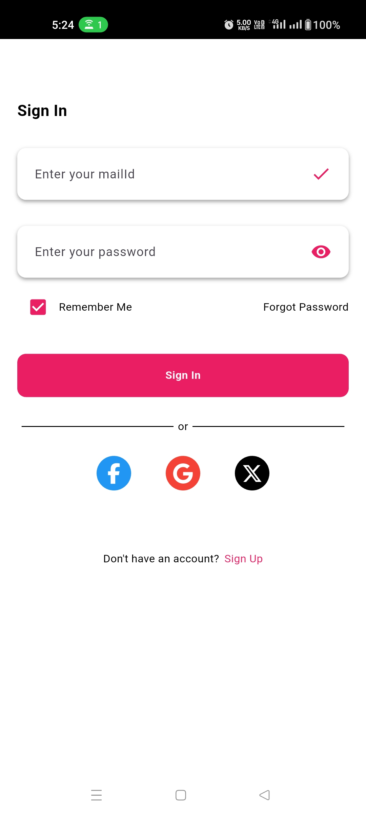
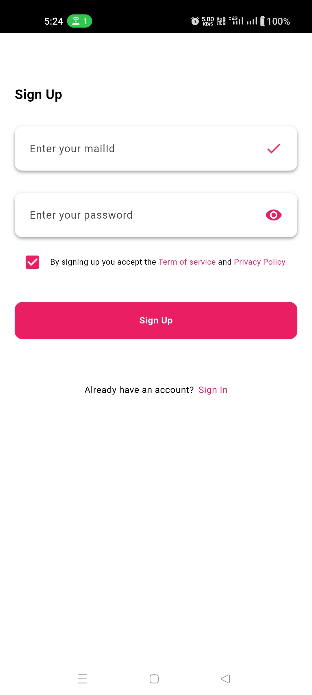

# 🔐 Flutter Login Page UI

A clean and modern **Login / Sign-Up UI** built using **Flutter**.  
This is a sample UI design project to showcase layout structuring and styling in Flutter apps.

---

## 📱 Screenshots

  
  

---

## 🎯 Features

- ✨ Beautiful and responsive UI
- 📲 Separate **Sign In** and **Sign Up** screens
- 📐 Built with clean layout and design principles
- 💻 Designed for both Android and iOS compatibility

---

## 🚧 Note

> This project is **UI-only** and does **not** include backend or authentication logic.  
It serves as a **starter template** or **design reference** for developers building Flutter-based login screens.

---
